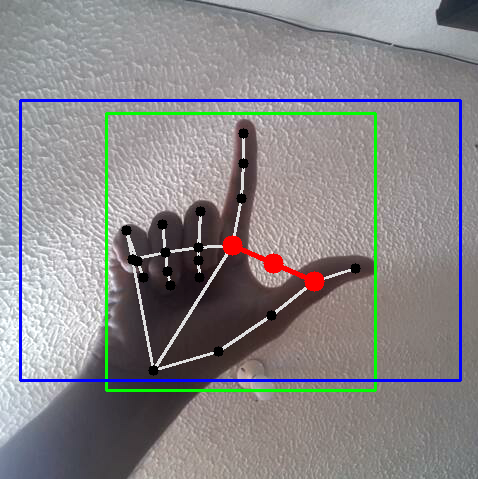
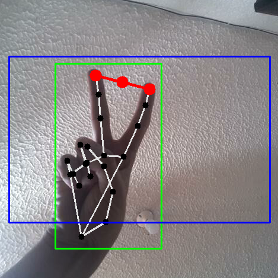
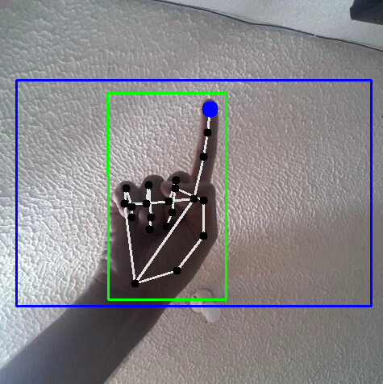
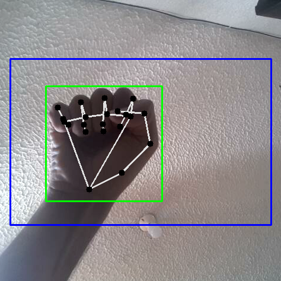
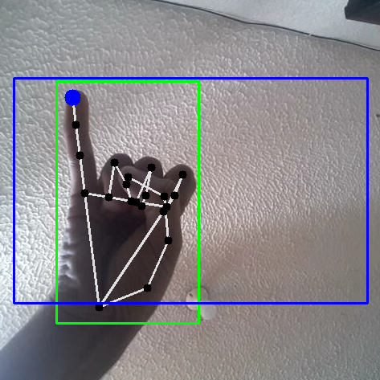
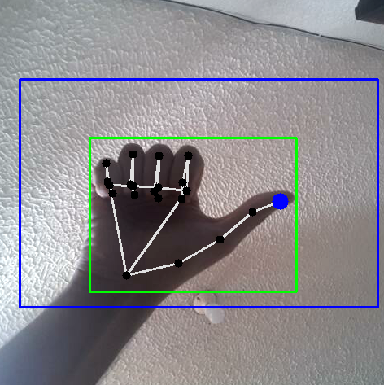
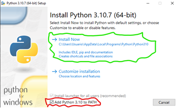

# :cyclone: MCHRUIS2022 :cyclone:
Este proyecto de pregrado ha sido realizado con el fin de generar una alternativa que facilite el desarrollo de un Docente o usuario común en una presentación realizada a una clase o un público específico. Todo esto mediante el desarollo de un algoritmo de aprendizaje profundo.

## :star: Requisitos mínimos :star:
*	Tener una Web Cam o dispositivo de salida de video.
*	Python 3.10.7
*	PyQt5 
*	Mediapipe 
*	Tensorflow 
* OpenCV 
*	Time ¿??
*	Pynput 
*	Pyautogui 
*	Winsound 
*	WinRaR


## :milky_way: Características :milky_way:
- MODO MOUSE
- MODO RECONOCIMIENTO DE GESTOS

## :hand: Gestos *(MODO MOUSE)* 👊
| Click Izquierdo | Click Derecho | Mover Mouse | No Seguimiento |
| --- | --- | --- | --- |
|  |  |  |  |

| Desplazarse arriba | Desplazarse abajo | Cambiar a modo RECONOCIMIENTO | Salir de MCHR |
| --- | --- | --- | --- |
|  |  |  |  |

## Gestos *(MODO RECONOCIMIENTO)*
| Silencio | Modo Mouse | F5 | ESC |
| --- | --- | --- | --- |
|  |  |  |  |

| DERECHA | IZQUIERDA | ON/OFF RECONOCIMIENTO |
| --- | --- | --- | 
|  |  |  | 


## Guía de instalación (Windows)
Para la instalación es necesario acceder al siguiente link de descarga: https://drive.google.com/file/d/10nLCzaP3M0eqhLqYXXXX_C5h6OnG6Z8yjWu/view?usp=sharing
Dentro de este encontrarás un archivo llamado MCHR.zip este contiene todos los archivos necesarios para la ejecución del mismo, sin embargo, es necesario instalar las librerías necesarias para el correcto funcionamiento de “MCHR”, para instalar los requerimientos mínimos sigue los siguientes pasos:

1. Instala Python 3.10.7. Para esto dirígete al siguiente enlace: https://www.python.org/downloads/release/python-3107/ . En la instalación de Python no olvides marcar la siguiente casilla para agregar la ruta de instalación de Python 3.10 a la variable de entorno PATH del sistema. Esto permite ejecutar el intérprete de Python desde cualquier lugar en la línea de comandos sin tener que especificar la ruta completa al ejecutable. También permite que otros programas utilicen las librerías de Python instaladas en su sistema. Luego puedes continuar con una instalación normal de Python con el botón “Install Now”.


2. Abre “Símbolo del sistema” ó “CMD”, de esta manera mediante el administrador de paquetes de Python “pip” instalaremos las librerías necesarias para la ejecución de MCHR, entonces hay que escribir cada una de las siguientes líneas en el símbolo del sistema:

# PyQt5
```python 
pip install PyQt5
```
# Mediapipe
```python 
pip install mediapipe
```
# Tensorflow
```python 
pip install tensorflow
```
# OpenCV
```python 
pip install opencv-python
```
# Pynput
```python 
pip install pynput
```
# Pyautogui
```python 
pip install pyautogui
```
3. Teniendo todas las librerías instaladas correctamente, es necesario entonces descomprimir el archivo MCHR.zip (Recomendación WinRaR para extraer el paquete) dentro de cualquier carpeta o directorio (Para mayor facilidad sugerimos el Escritorio).


## Contribuciones
Si deseas contribuir al desarrollo de esta aplicación, sigue estas instrucciones:
1. Haz un fork del repositorio.
2. Crea una rama para las modificaciones que desees hacer.
3. Haz un pull request.

