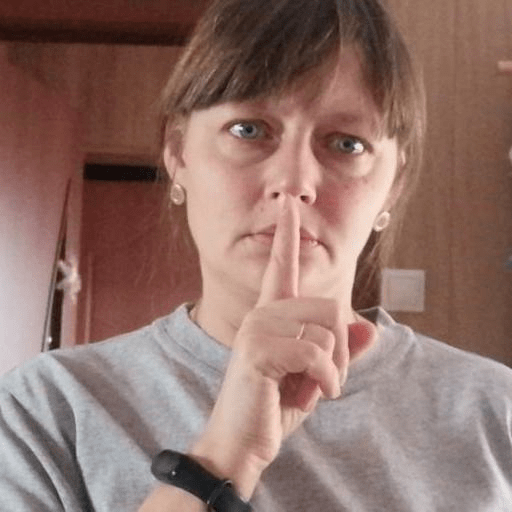

# MCHRUIS2022
Este proyecto de pregrado ha sido realizado con el fin de generar una alternativa que facilite el desarrollo de un Docente o usuario común en una presentación realizada a una clase o un público específico. Todo esto mediante el desarollo de un algoritmo de aprendizaje profundo.

## Características
- MODO MOUSE
- MODO RECONOCIMIENTO DE GESTOS

## Gestos *(MODO MOUSE)*
| Click Izquierdo | Click Derecho | Mover Mouse | No Seguimiento |
| --- | --- | --- | --- |
|  |  |  |  |

| Desplazarse arriba | Desplazarse abajo | Cambiar a modo RECONOCIMIENTO | Salir de MCHR |
| --- | --- | --- | --- |
|  |  |  |  |

## Gestos *(MODO RECONOCIMIENTO)*
| Silencio | Modo Mouse | F5 | ESC |
| --- | --- | --- | --- |
|  |  |  |  |

| DERECHA | IZQUIERDA | ON/OFF RECONOCIMIENTO |
| --- | --- | --- | 
|  |  |  | 

## Instalación
1. Descarga el archivo .apk o .ipa (para aplicaciones móviles)
2. Instala en tu dispositivo

## Licencia
Incluye la licencia bajo la cual se distribuye tu aplicación (por ejemplo, MIT License)

## Contribuciones
Si deseas contribuir al desarrollo de esta aplicación, sigue estas instrucciones:
1. Haz un fork del repositorio.
2. Crea una rama para las modificaciones que desees hacer.
3. Haz un pull request.

